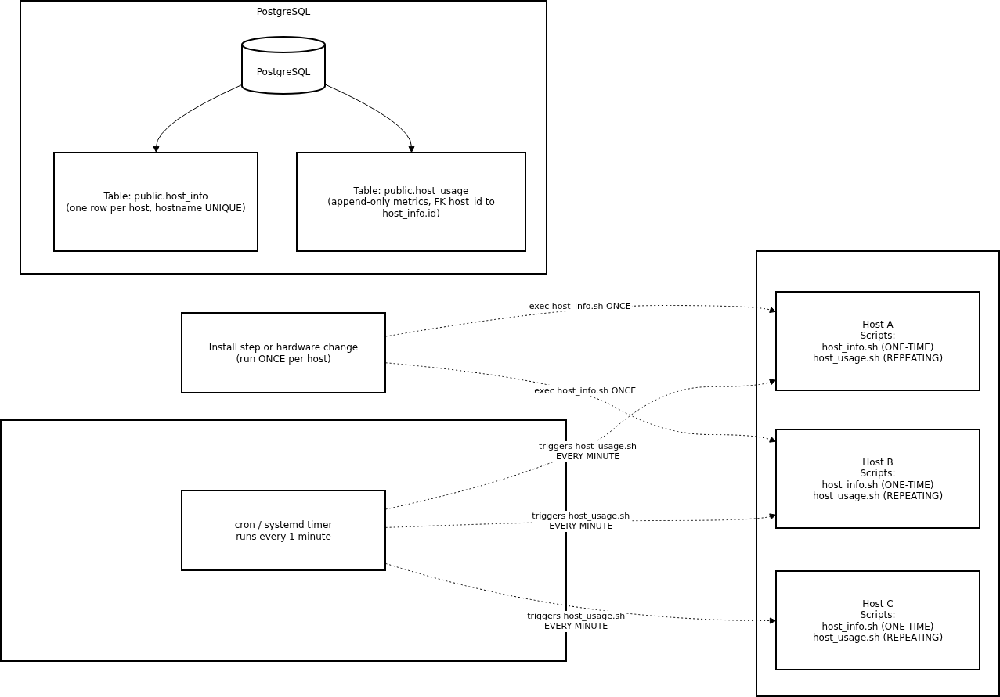

# Introduction
This project packages a lightweight monitoring agent written in Bash that runs on Linux hosts to collect:

- Static hardware specs (CPU model/arch, cores, L2 cache, memory, hostname).
- Runtime usage (free memory, CPU idle/kernel %, disk I/O, free disk).

Data is pushed into a central PostgreSQL database so an ops team can query fleet-wide health, spot capacity risks, and build dashboards.
The solution is intentionally simple and dev-friendly:
- Bash for portability
- cron for scheduling host usage scripts
- Docker (optional) for running PostgreSQL locally
- Git for versioned and reproducible features.

Users: SRE/DevOps engineers, platform teams, and managers who need fast visibility into host capacity and trends.

Tech: Bash, cron, psql CLI, PostgreSQL (optionally via Docker), Git.

# Quick Start
Assumes you have Docker and Bash installed. Replace values as needed.

- Start a psql instance using psql_docker.sh

```
bash scripts/psql_docker.sh create               # runs one-time: creates container + volume
bash scripts/psql_docker.sh start                # starts container (5432 mapped)
```

- Create tables using ddl.sql

```
psql -h 127.0.0.1 -p 5432 -U postgres -d host_agent -f sql/ddl.sql
```

- Insert hardware specs data into the DB using host_info.sh (one time)

```
bash scripts/host_info.sh 127.0.0.1 5432 host_agent postgres <password>
```

- Insert hardware usage data into the DB using host_usage.sh

```
bash scripts/host_usage.sh 127.0.0.1 5432 host_agent postgres <password>
```

- Crontab setup

```
# install
sudo dnf install -y cronie  # (or: sudo yum install -y cronie)

# enable + start
sudo systemctl enable --now crond
```

# Implementation
This project is a lightweight **Linux host monitoring agent** that collects (1) **static hardware specs** once and (2) **runtime usage metrics** every minute, then persists them to a central **PostgreSQL** database. The agent is implemented in **Bash** for portability, scheduled with **cron**, and can target a Postgres instance running natively or in **Docker**. Data lands in two tables: `public.host_info` (one row per host) and `public.host_usage` (append-only time series).

### Architecture (high level)
- **Agents (per host):**
    - `host_info.sh` parses `lscpu`, `vmstat`, `hostname`, `df`; normalizes units; **UPSERTs** one row per host into `host_info`.
    - `host_usage.sh` captures `memory_free`, `cpu_idle`, `cpu_kernel`, `disk_io`, `disk_available`; resolves `host_id` via hostname; **INSERTs** a new row into `host_usage`.
- **Database (PostgreSQL):**
    - `host_info`  dimension table (hardware snapshot). `UNIQUE(hostname)` + `SERIAL id`.
    - `host_usage` fact table (metrics over time). `host_id` FK ? `host_info(id)`.
- **Scheduler:** `cron` runs `host_usage.sh` every minute on each host.
- **Local Dev (optional):** `psql_docker.sh` provisions a Dockerized Postgres with a persistent volume.

### Why this design works
- **Simple + portable:** Bash + cron work on nearly any Linux distro.
- **Idempotent:** `host_info.sh` uses `INSERT ... ON CONFLICT (hostname) DO UPDATE`, so re-running updates rather than duplicates.
- **Queryable:** Central Postgres enables ad-hoc SQL for capacity planning, alerts, and dashboarding.

---

## Architecture
**Figure:** High-level diagram of host monitoring architecture.




## Scripts
Shell script description and usage 
### psql_docker.sh
- Purpose: Create/Start/Stop a local PostgreSQL in Docker with a persistent volume.
- Usage:
```
# create|start|stop [db_username] [db_password]  (create requires creds)
bash scripts/psql_docker.sh create postgres mypassword
bash scripts/psql_docker.sh start
bash scripts/psql_docker.sh stop
```

### host_info.sh

- Purpose: Collect static hardware specs and upsert into public.host_info.
- Usage:
```
bash scripts/host_info.sh <psql_host> <psql_port> <db_name> <psql_user> <psql_password>
# example:
bash scripts/host_info.sh 127.0.0.1 5432 host_agent postgres mypassword
```

### host_usage.sh
- Purpose: Collect runtime usage and insert into public.host_usage (append-only).
- Usage:
```
bash scripts/host_usage.sh <psql_host> <psql_port> <db_name> <psql_user> <psql_password>
# example:
bash scripts/host_usage.sh 127.0.0.1 5432 host_agent postgres mypassword
```
### crontab
- Purpose: Scedule host_usage.sh runs every minute.
- Usage:
```
crontab -e
```
#### then:
```
* * * * * /bin/bash /full/path/scripts/host_usage.sh 127.0.0.1 5432 host_agent postgres <password> \
> /tmp/host_usage.log
```
### queries.sql
- Examples of useful sql queries for the database:

### 1) Recent Samples (smoke check)
Verify data is arriving per host with current timestamps.
```sql
-- Latest 10 usage samples with hostnames
SELECT i.hostname,
       u."timestamp",
       u.memory_free,
       u.cpu_idle,
       u.cpu_kernel,
       u.disk_available
FROM public.host_usage u
         JOIN public.host_info  i ON i.id = u.host_id
ORDER BY u."timestamp" DESC
    LIMIT 10;
```

### 2) Host Inventory (hardware snapshot)
Inventory of all registered hosts and their specs.
```sql
SELECT id,
       hostname,
       cpu_number,
       cpu_architecture,
       cpu_model,
       cpu_mhz,
       l2_cache,
       total_mem,
       "timestamp" AS last_hw_update_utc
FROM public.host_info
ORDER BY hostname;
```

### 3) Low Disk Space hosts
Find hosts whose root filesystem free space is below a threshold (e.g., 5 GB)
```sql
-- Latest sample per host and filter by disk_available (MB)
WITH latest AS (
    SELECT u.*,
           ROW_NUMBER() OVER (PARTITION BY host_id ORDER BY "timestamp" DESC) AS rn
    FROM public.host_usage u
)
SELECT i.hostname,
       l."timestamp",
       l.disk_available
FROM latest l
         JOIN public.host_info i ON i.id = l.host_id
WHERE l.rn = 1
  AND l.disk_available < 5120     -- 5 GB
ORDER BY l.disk_available ASC;
```

These queries can help reveal some immediate operational risks (low disk, hot CPUs, low memory), show whether the monitoring pipeline is healthy (freshness), and provide the historical context required for capacity planning and procurement decisions.
## Database Modeling
- `host_info`

| Column            | Type        | Constraints                      | Description                                   |
|-------------------|-------------|----------------------------------|-----------------------------------------------|
| id                | SERIAL      | **PK**, NOT NULL                 | Auto-increment host identifier                 |
| hostname          | VARCHAR     | **UNIQUE**, NOT NULL             | Host’s name (prefer FQDN)                      |
| cpu_number        | SMALLINT    | NOT NULL                         | Logical CPU count                              |
| cpu_architecture  | VARCHAR     | NOT NULL                         | CPU architecture (e.g., `x86_64`, `aarch64`)   |
| cpu_model         | VARCHAR     | NOT NULL                         | CPU model string                               |
| cpu_mhz           | DOUBLE PRECISION | NOT NULL                    | CPU clock speed in MHz                         |
| l2_cache          | INTEGER     | NOT NULL                         | L2 cache size in **KiB**                       |
| total_mem         | INTEGER     | NOT NULL                         | Total memory in **KiB**                        |
| timestamp         | TIMESTAMP   | NOT NULL                         | UTC time of insertion/update                   |

**Indexes & Notes**
- Primary Key: `(id)`
- Unique Key: `(hostname)` ensures one row per host
- Typical access pattern: lookup by `hostname` or join via `id`

---

- `host_usage`

| Column         | Type        | Constraints                                  | Description                                        |
|----------------|-------------|----------------------------------------------|----------------------------------------------------|
| timestamp      | TIMESTAMP   | NOT NULL                                     | Sample time in **UTC**                             |
| host_id        | INTEGER     | NOT NULL, **FK ?** `public.host_info(id)`    | References host entry in `host_info`               |
| memory_free    | INTEGER     | NOT NULL                                     | Free memory in **MB**                              |
| cpu_idle       | SMALLINT    | NOT NULL                                     | CPU idle percentage (0–100)                         |
| cpu_kernel     | SMALLINT    | NOT NULL                                     | CPU kernel/system percentage (0–100)               |
| disk_io        | INTEGER     | NOT NULL                                     | Current disk I/O in progress (from `vmstat`)       |
| disk_available | INTEGER     | NOT NULL                                     | Free disk on `/` in **MB**                         |

**Indexes & Notes**
- Foreign Key: `(host_id)` references `host_info(id)`
- Recommended composite index: `(host_id, timestamp)` for time-series queries
- Append-only usage; rows represent periodic samples

# Test
How did you test your bash scripts DDL? What was the result?

### 1) Apply DDL and Verify Schema

**Run**
```bash
# Apply schema (tables: public.host_info, public.host_usage)
psql -h 127.0.0.1 -p 5432 -U postgres -d host_agent -f sql/ddl.sql

# Describe tables
psql -h 127.0.0.1 -p 5432 -U postgres -d host_agent -c "\d+ public.host_info"
psql -h 127.0.0.1 -p 5432 -U postgres -d host_agent -c "\d+ public.host_usage"
```
Expected Results:   

public.host_info exists with columns: id (SERIAL PK), hostname (UNIQUE), cpu_number, cpu_architecture, cpu_model, cpu_mhz, l2_cache, total_mem, "timestamp".

public.host_usage exists with columns: "timestamp", host_id (FK -> host_info.id), memory_free, cpu_idle, cpu_kernel, disk_io, disk_available.

No errors from ddl.sql. The \d+ output shows the correct types and constraints.


### 2) Test host_info.sh (One-Time Hardware Snapshot)

**Run**
```bash
# Insert/Upsert this host’s hardware specs (use your DB credentials)
bash scripts/host_info.sh 127.0.0.1 5432 host_agent postgres <password>

# Show the latest 5 rows (should include this host)
psql -h 127.0.0.1 -p 5432 -U postgres -d host_agent \
  -c "SELECT id, hostname, cpu_number, cpu_architecture, cpu_model, l2_cache, total_mem, \"timestamp\"
      FROM public.host_info
      ORDER BY id DESC
      LIMIT 5;"

# Optionally, filter by the current machine’s hostname
psql -h 127.0.0.1 -p 5432 -U postgres -d host_agent \
  -c "SELECT id, hostname, \"timestamp\"
      FROM public.host_info
      WHERE hostname IN ('$(hostname -f)', '$(hostname -s)')
      ORDER BY id DESC;"
```

Expected Results:

Exactly one row per host (hostname is unique).

If you re-run the script, the row updates (UPSERT), and "timestamp" reflects the most recent run.

l2_cache is in KiB, total_mem is in KiB, and strings (e.g., cpu_model) are properly saved.

### 3) Test host_usage.sh (Single Runtime Sample)

**Run**
```bash
# Insert one usage sample for this host
bash scripts/host_usage.sh 127.0.0.1 5432 host_agent postgres <password>


# Show the latest 5 usage rows with joined hostnames
psql -h 127.0.0.1 -p 5432 -U postgres -d host_agent \
  -c "SELECT i.hostname,
             u.\"timestamp\",
             u.memory_free,
             u.cpu_idle,
             u.cpu_kernel,
             u.disk_io,
             u.disk_available
      FROM public.host_usage u
      JOIN public.host_info i ON i.id = u.host_id
      ORDER BY u.\"timestamp\" DESC
      LIMIT 5;"

```
Expected Results:

One new row appears for each manual run.

Values look reasonable (e.g., memory_free in MB, cpu_idle in %, disk_available in MB).

"timestamp" is in UTC.

host_id correctly references your host in public.host_info.


### 4) (Optional) Cron-Based Growth Check (Just the Result)
If you already scheduled host_usage.sh by cron (every minute), you can check that rows are growing.

**Run**
```bash
# Count rows (should increase over time)
psql -h 127.0.0.1 -p 5432 -U postgres -d host_agent \
  -c "SELECT COUNT(*) AS rows_in_usage FROM public.host_usage;"

# Show the most recent samples again
psql -h 127.0.0.1 -p 5432 -U postgres -d host_agent \
  -c "SELECT i.hostname, u.\"timestamp\", u.memory_free, u.cpu_idle
      FROM public.host_usage u
      JOIN public.host_info i ON i.id = u.host_id
      ORDER BY u.\"timestamp\" DESC
      LIMIT 10;"
```

Expected Results:

COUNT(*) rises roughly once per minute (if cron is active).

Latest rows have recent timestamps and sensible metrics.

# Deployment
This project is deployed by combining a version-controlled repository, a PostgreSQL database, and lightweight per-host agents. The repository (hosted on GitHub) serves as the single source of truth containing the Bash agent scripts under `scripts/`, the schema under `sql/`, and documentation and assets used for operations and onboarding. For the database, you can either run a local developer instance in Docker using the helper script (`psql_docker.sh`) with a named volume for persistence, or point the agents to a managed PostgreSQL service in staging or production. In either case, the first deployment step is to apply `sql/ddl.sql` to provision `public.host_info` and `public.host_usage`.

On each Linux host, you roll out the agents by copying `host_info.sh` and `host_usage.sh` to a fixed path such as `/opt/host_agent/scripts/`. You then run `host_info.sh` once to upsert a single hardware row for that host, which is idempotent by design, and verify it inserted successfully. To collect runtime metrics continuously, you schedule `host_usage.sh` to run every minute. In simple environments this is done with a crontab entry that uses absolute paths, an optional `flock` lock file to prevent overlapping runs, and stdout/stderr redirection to log files. Credentials are provided securely via `~/.pgpass` so the job can run non-interactively. After one to two minutes, you confirm that `public.host_usage` is growing by examining recent rows and counts in the database. This flow scales cleanly from a single development machine to a fleet of servers by repeating the agent rollout and scheduler setup per host.

- Code: GitHub repository (scripts + SQL + assets).
- DB: Local Docker (psql_docker.sh) or a managed Postgres (RDS, Cloud SQL, etc.).
- Agent rollout: Copy scripts/host_info.sh and scripts/host_usage.sh to each host, run host_info.sh once, install cron entry for host_usage.sh.

# Improvements

One improvement I thought of initially is to implement richer, structured logging so debugging and testing are faster and more reliable. Redirecting raw stdout and stderr is workable but makes it hard to search, correlate, and automate checks. A better approach is for each script to emit JSON lines that include a timestamp in UTC, the hostname, the script name and action, execution duration, exit code, and an error field when something fails. These logs can be written to `/var/log/host_agent/agent.log` and rotated with `logrotate` to control disk usage. Because the format is structured, you can filter by fields with standard CLI tools, feed the data into log processors, and assert invariants in CI (for example, “insert succeeded and rows=1”). This change turns ad-hoc troubleshooting into a predictable and testable workflow.

The system for scheduling host_usage.sh runs could also be improved. We could replace cron with systemd units and timers for better reliability and operational control. Cron provides minimal supervision, inherits a narrow environment, and offers no retry or backoff when commands fail. Systemd can declare a dedicated service (running `host_usage.sh`) with an explicit environment and resource limits, and a timer that triggers the service every minute with optional jitter to reduce thundering-herd effects. You also gain automatic restarts on failure, clearer status and logs through `journalctl`, and easier lifecycle commands (`start`, `stop`, `status`, `enable`). In practice this yields fewer missed runs, more transparent observability, and simpler operations for SREs.

Another improvement could be to add offline buffering so the agent tolerates transient database or network outages without losing samples. Before attempting an insert, each run can serialize the metric record to a local spool directory such as `/var/spool/host_agent/` and then try to write it to PostgreSQL. On success, the file is removed; on failure, it remains queued and is retried on subsequent runs, with a cap to prevent unbounded growth. The agent can also emit a backlog size metric into the structured logs so operators see when the system is in a degraded but recoverable state. This approach introduces backpressure awareness and ensures sample continuity across outages, improving data quality and trust in the monitoring pipeline.
